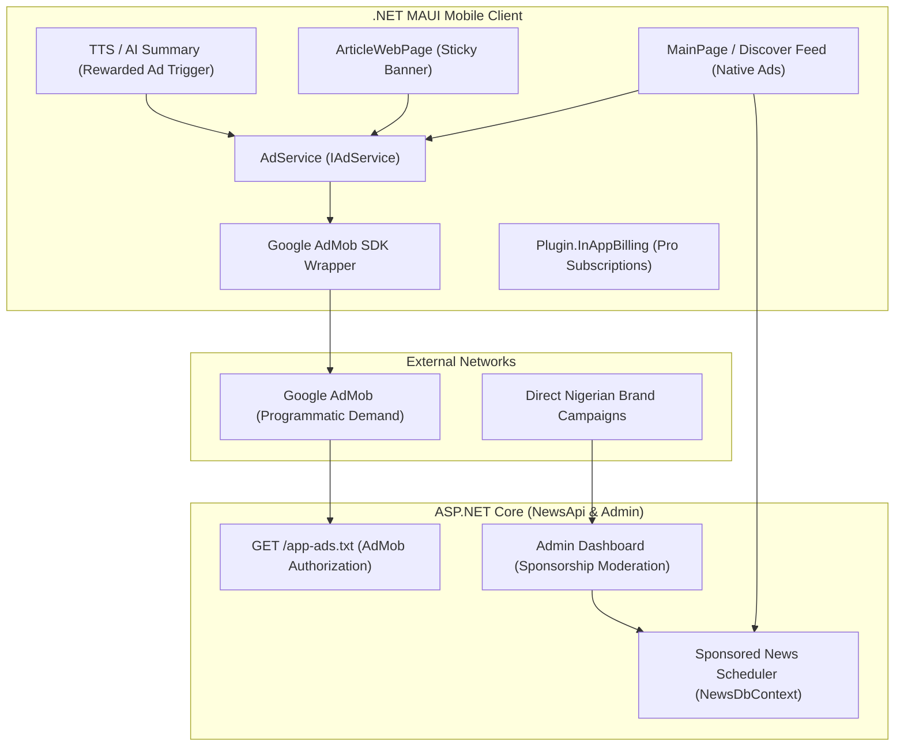

# Nigerian News Grid — Monetization & Ad Placement Architecture

This document defines the comprehensive monetization strategy, ad placement architecture, technical prerequisites, and rollout roadmap for **Nigerian News Grid** (.NET MAUI mobile app, ASP.NET Core API, Admin Dashboard, and background ingestion pipeline).

---

## 1. Monetization Models Matrix

| Model | Revenue Potential | User Friction | Implementation Effort | Best Suited Placements |
| :--- | :--- | :--- | :--- | :--- |
| **Programmatic Display & Native Ads (Google AdMob)** | High volume (scales with DAU/MAU) | Low to Medium | Low | Main feed, Discover, Sticky bottom reader view |
| **Direct Sponsored News & Corporate Press Releases** | Very High per deal (₦150k–₦1M+ per campaign) | Very Low | Low | Admin-managed native feed articles & pinned releases |
| **Rewarded Ads (Value Exchange)** | High eCPM ($3–$15+) | Zero (opt-in) | Low | Unlocking TTS audio briefings, AI 3-bullet summaries |
| **Capped Interstitial Ads** | Medium–High | Medium | Low | Navigation exits (max 1 per 4–5 article reads) |
| **Freemium / Pro Subscription ("News Grid Pro")** | Recurring MRR (₦1,000/mo or $1.99/mo) | Zero (for subscribers) | Medium | Ad-free toggle, offline audio caching, exclusive deep-dives |
| **Affiliate & Local Deals Widget** | High localized conversion | Low | Low | Nigerian fintechs, data recharge, job alerts, sports |

---

## 2. Ad Formats & Precise Placements

```
 ┌──────────────────────────────────────┐        ┌──────────────────────────────────────┐
 │          Nigerian News Grid          │        │        Article / Reader View         │
 │      Updated as at 17 Aug, 9:15      │        ├──────────────────────────────────────┤
 ├──────────────────────────────────────┤        │  [← Back]  [📖 Reader]  [🔖]  [↗]    │
 │ 📰 News Story 1                      │        ├──────────────────────────────────────┤
 │ 📰 News Story 2                      │        │ Headline & Full Web Content          │
 │ 📰 News Story 3                      │        │                                      │
 ├──────────────────────────────────────┤        │ ── [In-Article Inline Ad / Callout] ─│
 │ 📢 [Native In-Feed Sponsored Card]   │        │                                      │
 │    "Fast Savings & SME Loans"        │        │ ── [✨ Related Stories (9)] ─────────│
 ├──────────────────────────────────────┤        ├──────────────────────────────────────┤
 │ 📰 News Story 4                      │        │ 🏷️ [Sticky Bottom Adaptive Banner]   │
 │ 📰 News Story 5                      │        └──────────────────────────────────────┘
 └──────────────────────────────────────┘
```

### A. Native In-Feed Ads (UX Harmony & Maximum CTR)
- **Target Screens**: [MainPage.xaml](file:///c:/Users/ufuom/source/repos/NigerianNewGrid/NigerianNewGrid/MainPage.xaml) (Date-grouped chronological feed) and [DiscoverPage.xaml](file:///c:/Users/ufuom/source/repos/NigerianNewGrid/NigerianNewGrid/DiscoverPage.xaml) (Search results).
- **Placement Cadence**: Inserted seamlessly every **5th to 7th article** in the list.
- **Styling**: Rendered using the identical 132px height, green surface borders, and typography as standard news cards, distinguished only by a subtle theme-aware `Sponsored` / `Ad` badge pill.
- **Behavior**: Clicking opens advertiser landing URL or in-app custom web view.

### B. Sticky Bottom Compact Banner Ads (Standard 320x50)
- **Target Screen**: [ArticleWebPage.xaml](file:///c:/Users/ufuom/source/repos/NigerianNewGrid/NigerianNewGrid/ArticleWebPage.xaml) (Article reading & web view).
- **Placement & Sizing**: Pinned to the bottom viewport with a compact fixed 50dp height (`AdSize="Banner"`, `320x50`). Reduced from previous dynamic adaptive banners to maximize visible editorial reading space for news stories.
- **Reader Controls**: Includes a discreet dismiss button (`✕`) enabling readers to collapse the banner bar on demand and reclaim 100% of the viewport.
- **Advantage**: Balances consistent passive monetization dwell time with a clean, reader-first layout.

### C. Rewarded Ads for Value-Add Utilities
- **Target Actions**:
  - Unlocking on-demand Text-To-Speech (TTS) audio narration for a story (`TtsWorker`).
  - Generating AI-powered 3-bullet executive summaries.
  - Downloading daily briefing bundles for offline airplane/commute reading.
- **User Experience**: Users explicitly opt in to watch a 15–30s video in exchange for instant access to high-value features.

### D. Frequency-Capped Interstitials
- **Trigger**: Occurs strictly on back-navigation after reading multiple articles.
- **Guardrails**: Hard limit of **1 ad per 4–5 article reads** and at most **1 interstitial per 5 minutes**. Never show on initial app startup or upon opening the first story.

### E. Direct In-House Sponsored Content & Press Releases
- **Mechanism**: Ingested directly into `NewsApi` via the `AdminDashboard`.
- **Display**: Ranked at the top of relevant categories or interspersed in the main feed with verified sponsor branding (e.g., *Sponsored by Flutterwave* / *MTN*).

---

## 3. Architecture & Implementation Requirements



### 1. Prerequisites & Accounts
1. **Google AdMob Account**:
   - Register mobile apps: *Nigerian News Grid (Android)* & *Nigerian News Grid (iOS)*.
   - Generate Ad Unit IDs: Banner, Native Advanced, Interstitial, and Rewarded.
2. **`app-ads.txt` Hosting**:
   - Serve static `app-ads.txt` via `NewsApi` root domain (e.g. `https://api.nigeriannewsgrid.com/app-ads.txt`) to protect publisher inventory from domain spoofing.
3. **Store Developer Accounts**:
   - Google Play Console & Apple Developer Program accounts configured for In-App Purchases and Merchant Profiles.

### 2. .NET MAUI Client Setup
* **NuGet Packages**:
  - `Plugin.Maui.GoogleAds` (or `MarcTron.Plugin.CustomAdMob`) for AdMob integration.
  - `Plugin.InAppBilling` for Google Play / Apple StoreKit in-app purchases.
* **Platform Manifests**:
  - Android: `AndroidManifest.xml` with AdMob App ID `<meta-data>` and network security configuration.
  - iOS: `Info.plist` with `GADApplicationIdentifier` and `SKAdNetworkItems`.
* **Ad Service Abstraction**:
  - `IAdService` with methods: `Initialize()`, `ShowInterstitialIfEligibleAsync()`, `ShowRewardedAdAsync(onReward)`, and `IsPremiumUser` state bypass.

### 3. Backend & Admin Dashboard Setup
* **Database Entity Updates (`NewsDbContext`)**:
  - Add fields to `Article`:
    - `bool IsSponsored { get; set; }`
    - `string? SponsorName { get; set; }`
    - `string? SponsorUrl { get; set; }`
    - `DateTime? CampaignExpiresAt { get; set; }`
* **Admin Dashboard Management**:
  - New "Sponsored Articles & Campaigns" tab in `AdminDashboard` to create, schedule, prioritize, and track direct sponsored news releases.
* **Ad Verification Route**:
  - ASP.NET Core minimal endpoint in `NewsApi` (`Program.cs`):
    ```csharp
    app.MapGet("/app-ads.txt", () => Results.Text("google.com, pub-XXXXXXXXXXXXXXXX, DIRECT, f08c47fec0942fa0", "text/plain"));
    ```

---

## 4. Rollout Phases

1. **Phase 1 — In-House Sponsorship Engine & Admin Tools**
   - Add direct sponsorship flags to `NewsDbContext`, `NewsApi`, and `AdminDashboard`.
   - Start monetizing directly with Nigerian PR/corporate clients without waiting for ad network approvals.
2. **Phase 2 — Google AdMob Display & In-Feed Native Ads**
   - Setup AdMob accounts, `app-ads.txt`, and MAUI SDK bindings.
   - Inject native ad cards into `MainPage` and adaptive sticky banners into `ArticleWebPage`.
3. **Phase 3 — Rewarded Ads for Value Features**
   - Connect rewarded ad callbacks to unlock Text-To-Speech audio player (`TtsWorker`) and AI digest summaries.
4. **Phase 4 — "News Grid Pro" Subscriptions**
   - Implement `Plugin.InAppBilling` to allow monthly/annual subscriptions that disable all programmatic ads and unlock offline audio caching.


### Admob Details

 **Android**

App Id: ca-app-pub-0810356418854639~3397453941

Ad unit ID: ca-app-pub-0810356418854639/7601009567 Banner Ad
Ad unit ID: ca-app-pub-0810356418854639/8492878270 Native Advance  


**iOS**

app Id: ca-app-pub-0810356418854639~7145127262

Ad unit ID: ca-app-pub-0810356418854639/5209689482 Native Advance 
Ad unit ID: ca-app-pub-0810356418854639/2200382762 Banner Ad