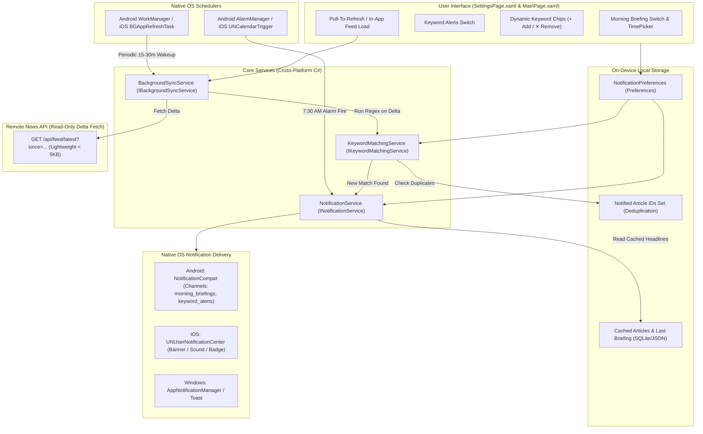

# Nigerian News Grid — On-Device Notifications & Keyword Alerts Architecture

This document defines the technical architecture, user experience design, and implementation specification for **On-Device Daily Morning Briefings** and **On-Device Keyword-Based Breaking News Alerts** in the Nigerian News Grid mobile application.

---

## 1. Core Principles: Edge-First & Privacy-Preserving

1. **Zero Backend Keyword Tracking**: The user's monitored keywords, topics of interest, and notification schedules never leave the local device. No personal telemetry or user search preferences are sent to or stored on backend servers.
2. **Zero Cloud Push Infrastructure Cost**: Operates without expensive server-side push brokers (such as Firebase Cloud Messaging, Azure Notification Hubs, or custom APNs servers), database token tables, or per-user alert dispatch pipelines.
3. **Offline & Low-Bandwidth Resilience**: Morning briefings are synthesized from locally cached news data. Keyword evaluation uses lightweight delta feeds (<5 KB) with conditional HTTP caching (`ETag` / `If-Modified-Since`) or background polling workers.

---

## 2. Feature Specifications

```
 ┌─────────────────────────────────────────────────────────────┐
 │                         SETTINGS                            │
 ├─────────────────────────────────────────────────────────────┤
 │ NOTIFICATIONS                                               │
 │ ┌─────────────────────────────────────────────────────────┐ │
 │ │ ☀️ Daily Morning Briefing                        [ON ] │ │
 │ │    Delivery Time: 7:30 AM                       [Edit]  │ │
 │ ├─────────────────────────────────────────────────────────┤ │
 │ │ 🔔 Keyword Alerts                                [ON ] │ │
 │ │    Notify me when incoming news matches keywords        │ │
 │ │    (Evaluated 100% privately on-device)                 │ │
 │ │                                                         │ │
 │ │    Active Keywords:                                     │ │
 │ │    [ Naira ✕ ] [ Tinubu ✕ ] [ Super Eagles ✕ ]          │ │
 │ │    [ + Add Keyword...                                 ] │ │
 │ │                                                         │ │
 │ │    Popular Suggestions:                                 │ │
 │ │    [+ EFCC]  [+ Fuel Price]  [+ Tech/Startups]          │ │
 │ └─────────────────────────────────────────────────────────┘ │
 └─────────────────────────────────────────────────────────────┘
```

### A. Daily Morning Briefing (On-Device Local Alarm)
* **Objective**: Deliver a scheduled morning notification at the user's chosen time (e.g., *"☀️ Good morning! 24 fresh stories across Politics, Business & Sports"* or curated top headlines).
* **Delivery Mechanism**: Local repeating notification scheduled natively on-device via `AlarmManager` (Android) and `UNCalendarNotificationTrigger` (iOS).
* **Synthesis Pipeline**:
  1. Trigger fires at the scheduled time (default: `07:30 AM`).
  2. Reads the locally cached briefing payload from SQLite / Preferences (`last_briefing`).
  3. If online, executes an opportunistic 3-second delta sync; if offline or slow, seamlessly generates briefing copy from local cached top stories.
  4. Dispatches local notification directly to the OS notification drawer.
* **Customization**:
  * Toggle ON/OFF switch.
  * TimePicker control (defaults to `07:30 AM`).

### B. Keyword-Based Breaking News Alerts (On-Device Evaluation)
* **Objective**: Alert users when newly published news articles match monitored topics (e.g., *"Naira"*, *"Tinubu"*, *"EFCC"*, *"Fuel Price"*, *"Osimhen"*, *"INEC"*).
* **Freshness & Recency Gate (Strict)**:
  * **Fresh Stories Only**: Notifications strictly evaluate articles that are newly updated/published within a recent window (e.g., published within the last 2 hours or after `LastKeywordAlertEvaluationUtc`).
  * **No Historical Spam**: Adding a new keyword or launching the app will never trigger alerts for historical/backlog stories already stored. Initial activation sets the baseline to `DateTime.UtcNow`.
* **Evaluation Engine**: High-performance, case-insensitive word-boundary regex matching (`\bkeyword\b`) evaluated in C# against ingested article headlines and summaries.
* **Sync & Trigger Engine**:
  * **Foreground**: Evaluated immediately during pull-to-refresh, category switches, and initial app load against fresh stories.
  * **Background**: Periodic background sync workers (Android `WorkManager` / iOS `BGAppRefreshTask`) fetch lightweight article deltas, run the local regex matcher on fresh delta items, and post local OS notifications for new matches.
* **Deduplication & Anti-Spam**:
  * Maintains an on-device `HashSet<string>` of notified article IDs in local storage (`notified_article_ids`) to ensure each story alerts at most once.
* **Customization**:
  * Master toggle ON/OFF.
  * Dynamic keyword chip management (add custom keywords, tap `✕` to delete).
  * Quick-add preset chips for trending Nigerian news topics.

---

## 3. Technical Architecture



---

## 4. Implementation Details & Code Contracts

### 1. Local State Storage (`NotificationPreferences.cs`)
```csharp
using System.Text.Json;

namespace NigerianNewGrid.Services;

public static class NotificationPreferences
{
    private const string MorningEnabledKey = "morning_briefing_enabled";
    private const string MorningTimeKey = "morning_briefing_time_mins";
    private const string KeywordAlertsEnabledKey = "keyword_alerts_enabled";
    private const string MonitoredKeywordsKey = "monitored_keywords";
    private const string NotifiedArticleIdsKey = "notified_article_ids";
    private const string LastSyncTimeKey = "last_background_sync_utc";
    private const string LastAlertEvaluationTimeKey = "last_keyword_alert_eval_utc";

    public static bool MorningBriefingEnabled
    {
        get => Preferences.Get(MorningEnabledKey, true);
        set => Preferences.Set(MorningEnabledKey, value);
    }

    public static TimeSpan MorningBriefingTime
    {
        get => TimeSpan.FromMinutes(Preferences.Get(MorningTimeKey, 450)); // 7:30 AM default
        set => Preferences.Set(MorningTimeKey, (int)value.TotalMinutes);
    }

    public static bool KeywordAlertsEnabled
    {
        get => Preferences.Get(KeywordAlertsEnabledKey, false);
        set
        {
            // When user first enables keyword alerts, set baseline to now so historical articles are not alerted
            if (value && !Preferences.ContainsKey(LastAlertEvaluationTimeKey))
            {
                LastKeywordAlertEvaluationUtc = DateTime.UtcNow;
            }
            Preferences.Set(KeywordAlertsEnabledKey, value);
        }
    }

    public static List<string> MonitoredKeywords
    {
        get
        {
            var json = Preferences.Get(MonitoredKeywordsKey, "[\"Naira\",\"Tinubu\",\"EFCC\"]");
            try { return JsonSerializer.Deserialize<List<string>>(json) ?? []; }
            catch { return ["Naira", "Tinubu", "EFCC"]; }
        }
        set => Preferences.Set(MonitoredKeywordsKey, JsonSerializer.Serialize(value));
    }

    public static HashSet<string> NotifiedArticleIds
    {
        get
        {
            var json = Preferences.Get(NotifiedArticleIdsKey, "[]");
            try { return JsonSerializer.Deserialize<HashSet<string>>(json) ?? []; }
            catch { return []; }
        }
        set => Preferences.Set(NotifiedArticleIdsKey, JsonSerializer.Serialize(value));
    }

    public static DateTime LastKeywordAlertEvaluationUtc
    {
        get => DateTime.TryParse(Preferences.Get(LastAlertEvaluationTimeKey, string.Empty), out var dt)
            ? dt
            : DateTime.UtcNow;
        set => Preferences.Set(LastAlertEvaluationTimeKey, value.ToString("o"));
    }

    public static DateTime LastBackgroundSyncUtc
    {
        get => DateTime.TryParse(Preferences.Get(LastSyncTimeKey, string.Empty), out var dt) 
            ? dt 
            : DateTime.UtcNow.AddHours(-6);
        set => Preferences.Set(LastSyncTimeKey, value.ToString("o"));
    }
}
```

### 2. On-Device Keyword Matching Engine (`IKeywordMatchingService.cs`)
```csharp
using System.Text.RegularExpressions;
using NigerianNewsGrid.Client.Models;

namespace NigerianNewGrid.Services;

public interface IKeywordMatchingService
{
    List<(BriefingItem Article, string MatchedKeyword)> EvaluateFreshArticles(
        IEnumerable<BriefingItem> articles, 
        IReadOnlyList<string> keywords,
        DateTime? publishedAfterUtc = null);
}

public sealed class KeywordMatchingService : IKeywordMatchingService
{
    private static readonly TimeSpan MaxFreshnessWindow = TimeSpan.FromHours(2);

    public List<(BriefingItem Article, string MatchedKeyword)> EvaluateFreshArticles(
        IEnumerable<BriefingItem> articles, 
        IReadOnlyList<string> keywords,
        DateTime? publishedAfterUtc = null)
    {
        var results = new List<(BriefingItem Article, string MatchedKeyword)>();
        if (keywords.Count == 0) return results;

        var notifiedIds = NotificationPreferences.NotifiedArticleIds;
        var cutoff = publishedAfterUtc ?? NotificationPreferences.LastKeywordAlertEvaluationUtc;
        var minAllowedTime = DateTime.UtcNow.Subtract(MaxFreshnessWindow);
        if (cutoff < minAllowedTime) cutoff = minAllowedTime;

        // Build compiled regex with word boundaries for whole-word/phrase matching
        var pattern = $@"\b({string.Join("|", keywords.Select(Regex.Escape))})\b";
        var regex = new Regex(pattern, RegexOptions.IgnoreCase | RegexOptions.CultureInvariant | RegexOptions.Compiled);

        foreach (var article in articles)
        {
            if (string.IsNullOrWhiteSpace(article.Id) || notifiedIds.Contains(article.Id))
                continue;

            // Strict Freshness Gate: must be published after the baseline cutoff
            if (article.PublishedAt.HasValue && article.PublishedAt.Value.ToUniversalTime() < cutoff)
                continue;

            var textToSearch = $"{article.Title} {article.Summary}";
            var match = regex.Match(textToSearch);
            if (match.Success)
            {
                results.Add((article, match.Value));
            }
        }

        return results;
    }
}
```

### 3. Notification Service Abstraction (`INotificationService.cs`)
```csharp
namespace NigerianNewGrid.Services;

public interface INotificationService
{
    Task<bool> RequestPermissionAsync();
    void ScheduleDailyMorningBriefing(TimeSpan deliveryTime);
    void CancelDailyMorningBriefing();
    void ShowBriefingNotification(string title, string message);
    void ShowKeywordAlertNotification(string keyword, string articleTitle, string articleId);
}
```

### 4. Native Platform Implementations

#### Android Platform (`Platforms/Android/NotificationService.cs` & `NewsSyncWorker.cs`)
* **Permissions**: `POST_NOTIFICATIONS` runtime permission check on Android 13+ (API 33).
* **Notification Channels**:
  * `morning_briefings`: Channel Name: *"Daily Morning Briefings"*, Importance: `Default`.
  * `keyword_alerts`: Channel Name: *"Breaking Keyword Alerts"*, Importance: `High`, EnableVibration: `true`.
* **Alarm Scheduling**: Uses `AlarmManagerCompat.SetExactAndAllowWhileIdle()` targeting a `MorningBriefingBroadcastReceiver`.
* **Reboot Resilience**: `BootCompletedBroadcastReceiver` registered with `ACTION_BOOT_COMPLETED` to re-register the morning alarm after device restart.
* **Background Sync**: `PeriodicWorkRequest` (15–30 min interval) via `AndroidX.WorkManager` with `NetworkType.Connected` and `BatteryNotLow` constraints.

#### iOS Platform (`Platforms/iOS/NotificationService.cs`)
* **Permissions**: `UNUserNotificationCenter.Current.RequestAuthorizationAsync(UNAuthorizationOptions.Alert | UNAuthorizationOptions.Badge | UNAuthorizationOptions.Sound)`.
* **Morning Briefing Trigger**: `UNCalendarNotificationTrigger` initialized with `NSDateComponents { Hour = deliveryTime.Hours, Minute = deliveryTime.Minutes, Repeats = true }`.
* **Foreground Handling**: `UNUserNotificationCenterDelegate` overriding `WillPresentNotification` with `UNNotificationPresentationOptions.Banner | UNNotificationPresentationOptions.Sound`.
* **Background Tasks**: `BGTaskScheduler.Register` with `BGAppRefreshTask` to process delta sync when iOS wakes the app.

---

## 5. Settings Page UX Integration Plan

In [SettingsPage.xaml](file:///c:/Users/ufuom/source/repos/NigerianNewGrid/NigerianNewGrid/SettingsPage.xaml), add the `NOTIFICATIONS` section between `BRIEFING LANGUAGE` and `ABOUT`:

1. **Morning Briefing Section**:
   * Header: `☀️ Daily Morning Briefing` with master toggle `Switch`.
   * Time Picker: `Delivery Time` (defaults to 07:30 AM).
2. **Keyword Alerts Section**:
   * Header: `🔔 Keyword Alerts` with master toggle `Switch`.
   * Subtitle: *"Evaluated 100% privately on your device"*.
   * Active Chips: `FlexLayout` displaying interactive chips with `✕` tap-to-remove.
   * Input Row: `Entry` + `Add (+)` button to register custom keywords.
   * Quick Suggestions: Preset chips (*Naira*, *Tinubu*, *Fuel Price*, *Super Eagles*, *EFCC*, *Tech/Startups*).

---

## 6. Verification & Quality Plan

1. **Unit & Matching Tests**:
   * Validate regex word boundary matching (e.g., matching `"Naira"` should not trigger on `"Nairaland"` unless specified, case insensitivity `"tinubu"` matches `"Tinubu"`).
   * Verify deduplication ensures an article is never notified twice.
2. **On-Device Lifecycle Verification**:
   * Test alarm firing while app is closed, suspended, or device is rebooted.
   * Verify battery consumption is negligible using Android Battery Historian / Xcode Energy Gauge.
