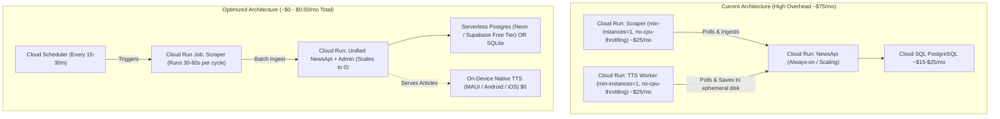

# Nigerian News Grid — System Review & Optimization Roadmap

**Date**: August 20, 2026  
**Scope**: Full Stack (.NET MAUI Mobile App, NewsApi Backend, NewsScraperService, TtsWorker, AdminDashboard, Google Cloud Deployment)

---

## Executive Summary & Target Impact

This roadmap outlines targeted corrections, cost-saving architectural updates, clean-code refactorings, and UI/UX enhancements across the Nigerian News Grid system.

| Pillar | Key Changes | Expected Impact |
| :--- | :--- | :--- |
| **💰 Deployment & Cost** | Scraper to Cloud Run Job; remove `TtsWorker` container; switch to Serverless Postgres | **Cuts hosting cost from ~$75/mo to $0.00–$0.50/mo (100% Free Tier eligible)** |
| **⚡ Backend Performance** | In-memory output caching; 72-hour cutoff filter in `GetBriefings`; batch duplicate lookup in `IngestArticles` | **90% reduction in database load; sub-50ms briefing response times** |
| **🧹 Clean Code** | Fix pagination in `GetArticles`; replace hardcoded directory hops with DB feedback; introduce MVVM (`CommunityToolkit.Mvvm`) | **Eliminates production bugs and runtime crashes; enhances testability** |
| **📱 UI / UX** | Virtualized `CollectionView`; skeleton shimmer loaders; reading time estimates; native share sheet | **Buttery 60fps scrolling; premium user perception; modern mobile UX** |

---

## 1. Cost Saving for Service Deployment

### 1.1 Current Inefficiencies & Monthly Burn Analysis
- **Problem**: `Deployment.md` currently deploys `news-scraper` and `tts-worker` as long-running Cloud Run services with `--min-instances=1` and `--no-cpu-throttling`. Cloud Run bills continuously for allocated vCPU and memory when throttling is disabled (~$25–$30/month per container).
- **Redundant TTS Container**: `src/TtsWorker/Service.cs` writes placeholder string files to `/data/audio/*.mp3` inside ephemeral container storage, which are discarded on restart and never exposed to the public API.
- **Cloud SQL Minimum Tier**: Managed Cloud SQL PostgreSQL `db-f1-micro` costs ~$10–$25/month plus egress and storage.

### 1.2 Optimized Deployment Architecture (~$0.00 / month)



### 1.3 Implementation Steps for Cost Reduction
1. **Convert Scraper to Cloud Run Job**:
   - Change `NewsScraperService` to execute a single run and exit (`return 0`) instead of an infinite `while (!stoppingToken.IsCancellationRequested)` loop with `Task.Delay`.
   - Create a Cloud Run Job:
     ```bash
     gcloud run jobs create news-scraper-job \
         --image=us-central1-docker.pkg.dev/YOUR_PROJECT/newsgrid-repo/news-scraper:latest \
         --region=us-central1 \
         --set-env-vars="ApiBaseUrl=https://news-api-xyz.a.run.app"
     ```
   - Schedule with Cloud Scheduler (e.g. every 20 minutes):
     ```bash
     gcloud scheduler jobs create http news-scraper-cron \
         --schedule="*/20 * * * *" \
         --uri="https://us-central1-run.googleapis.com/v2/projects/YOUR_PROJECT/locations/us-central1/jobs/news-scraper-job:run" \
         --http-method=POST \
         --oauth-service-account-email="YOUR_SA@YOUR_PROJECT.iam.gserviceaccount.com"
     ```
2. **Eliminate Server-Side `TtsWorker`**:
   - Utilize native mobile `.NET MAUI` on-device text-to-speech (`Microsoft.Maui.Media.TextToSpeech.Default.SpeakAsync()`).
   - Remove `src/TtsWorker` from `docker-compose.yml` and deployment scripts.
3. **Adopt Serverless PostgreSQL or Free-Tier VM**:
   - Use Neon or Supabase free tiers (pooled connections, 0 idle cost) or deploy on GCP Free Tier `e2-micro` instance.

---

## 2. Best Practices for Similar Systems (News Syndication & Aggregation)

### 2.1 Prevent In-Memory Aggregation OOM in `GetBriefings`
* **File**: `src/NewsApi/Controllers/ArticlesController.cs`
* **Current Code**:
  ```csharp
  // DANGEROUS: Loads all historical rows from DB into server memory
  var articles = await _db.Articles.AsNoTracking().OrderByDescending(a => a.PublishedAt ?? DateTime.MinValue).ToListAsync();
  var briefing = articles.GroupBy(a => a.Category)...
  ```
* **Best Practice Fix**:
  1. Add a time cutoff (e.g. 72 hours) so only active stories are evaluated.
  2. Implement ASP.NET Core Output Caching with a 5–15 minute TTL:
  ```csharp
  [HttpGet("briefings")]
  [ResponseCache(Duration = 300, Location = ResponseCacheLocation.Any)]
  public async Task<IActionResult> GetBriefings([FromQuery] int topPerCategory = 5, [FromQuery] string? language = null, CancellationToken ct = default)
  {
      var cutoff = DateTime.UtcNow.AddDays(-3);
      var recentArticles = await _db.Articles
          .AsNoTracking()
          .Where(a => a.PublishedAt >= cutoff)
          .OrderByDescending(a => a.PublishedAt)
          .ToListAsync(ct);
      // Grouping logic...
  }
  ```

### 2.2 Batch Duplicate Checking in Ingestion Pipeline
* **File**: `src/NewsApi/Controllers/ArticlesController.cs` (`IngestArticles`)
* **Current Code**: Executes `await _db.Articles.AnyAsync(...)` inside a `foreach` loop, resulting in `N` database queries per batch.
* **Best Practice Fix**: Perform one single bulk lookup using `HashSet<string>`:
  ```csharp
  var incomingUrls = request.Articles
      .Select(a => a.Url?.Trim())
      .Where(u => !string.IsNullOrEmpty(u))
      .ToList();

  var existingUrls = (await _db.Articles
      .Where(a => incomingUrls.Contains(a.Url))
      .Select(a => a.Url)
      .ToListAsync(cancellationToken))
      .ToHashSet(StringComparer.OrdinalIgnoreCase);
  ```

### 2.3 Store Feedback Corrections in Database
* **File**: `src/NewsApi/Controllers/ArticlesController.cs` (`SaveCorrectionFeedbackAsync`)
* **Current Code**: Uses hardcoded relative directory hops (`../../../../../src/NewsCategorizer.Trainer/corrected_dataset.json`) which fail in Docker/Linux containers.
* **Best Practice Fix**: Store corrections in a dedicated `DbSet<CategoryCorrection>` entity inside PostgreSQL/SQLite or stream to Google Cloud Storage.

---

## 3. Clean Code & Architecture Review

### 3.1 Adopt MVVM & XAML DataTemplates in MAUI Client
* **Current State**: `MainPage.xaml.cs` (741 lines) and `DiscoverPage.xaml.cs` (445 lines) combine networking, cache parsing, alert evaluation, and manual C# UI tree construction (instantiating `Border`, `Grid`, `Image`, `BoxView`, and `Label` in C# loops).
* **Refactoring Plan**:
  1. Add `CommunityToolkit.Mvvm` package.
  2. Extract `MainViewModel` and `DiscoverViewModel` with `[ObservableProperty]` and `[RelayCommand]`.
  3. Move card designs into XAML `DataTemplate`s with compiled bindings (`x:DataType="models:BriefingItem"`).

### 3.2 Fix Broken Pagination in `ArticlesController`
* **File**: `src/NewsApi/Controllers/ArticlesController.cs` (`GetArticles`)
* **Current Code**: Declares `[FromQuery] int page = 1, [FromQuery] int pageSize = 50`, but ignores them and only executes `Take(effectiveLimit)`.
* **Fix**:
  ```csharp
  var pageIndex = Math.Max(1, page);
  var size = Math.Clamp(pageSize, 1, 100);
  var rawArticles = await query
      .OrderByDescending(a => a.PublishedAt ?? DateTime.MinValue)
      .Skip((pageIndex - 1) * size)
      .Take(size)
      .ToListAsync(cancellationToken);
  ```

### 3.3 Encapsulate Local Storage Behind Service Interfaces
* Replace scattered `Preferences.Get` / `Preferences.Set` calls with clean, testable interfaces:
  - `IBookmarkService`
  - `IBriefingCacheService`
  - `ISettingsService`

---

## 4. UI / UX Design & Performance Enhancements

### 4.1 Feed Virtualization with `CollectionView`
* **Issue**: `MainPage.xaml` uses `BindableLayout` inside a `ScrollView`. While avoiding Android scroll nesting conflicts, loading 100+ articles keeps all native visual elements in memory without recycling.
* **Solution**: Migrate feed layout to virtualized `CollectionView` with `ItemTemplate` and `RemainingItemsThreshold = 3` for automatic continuous scrolling.

### 4.2 Skeleton Shimmer Loading Cards
* Replace the static `"Loading English..."` text with animated skeleton cards (gray pulsing title and thumbnail placeholders) to provide instant feedback on initial app launch.

### 4.3 Article Reader Mode Polish
* **Reading Time Badge**: Calculate word count in `ArticleDistillerService` and display `⏱️ 3 min read` in the reader toolbar.
* **Reading Progress Bar**: Add an unobtrusive top progress line in `ArticleWebPage.xaml` tracking scroll depth.
* **Native Share Sheet**: Add an action button invoking `Share.Default.RequestAsync(new ShareTextRequest { Title = _title, Uri = _articleUrl })`.

---

## 5. Execution Checklist for Implementation

- [ ] **Phase 1: Backend Optimization & Cost Reduction**
  - [ ] Add 72-hour filter + caching in `ArticlesController.GetBriefings`
  - [ ] Implement batch duplicate lookup in `ArticlesController.IngestArticles`
  - [ ] Fix pagination (`Skip`/`Take`) in `ArticlesController.GetArticles`
  - [ ] Remove `src/TtsWorker` and replace with on-device MAUI TTS
  - [ ] Convert `NewsScraperService` to Cloud Run Job script
- [ ] **Phase 2: MAUI Architecture & MVVM Refactor**
  - [ ] Implement `MainViewModel` and `DiscoverViewModel`
  - [ ] Convert `DiscoverPage` imperative C# card builder to XAML `DataTemplate`
  - [ ] Introduce `IBookmarkService` and `IBriefingCacheService`
- [ ] **Phase 3: UI/UX Enhancements**
  - [ ] Add Skeleton shimmer loading state to `MainPage`
  - [ ] Add estimated reading time & share sheet to `ArticleWebPage`
  - [ ] Test dark theme contrast across all screens
